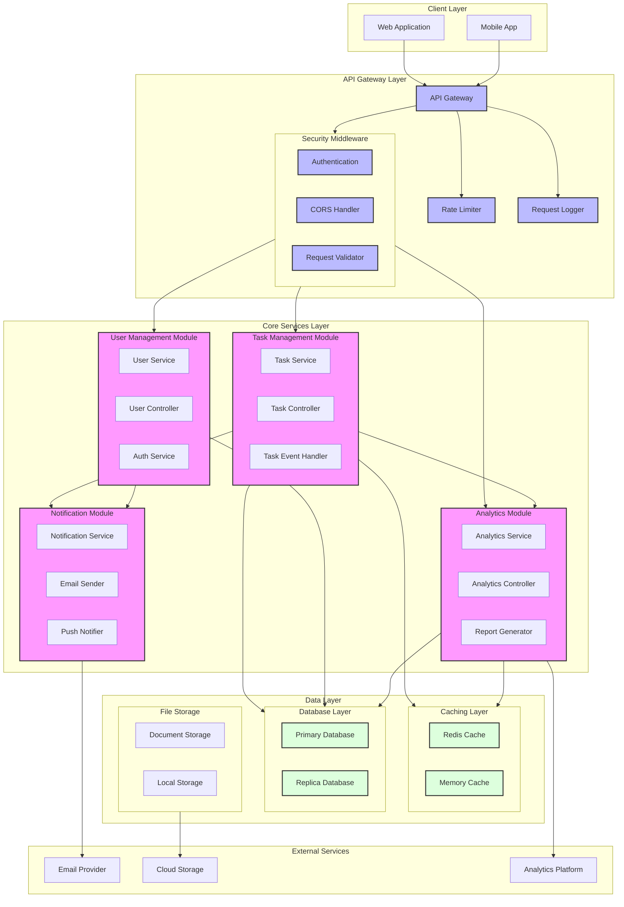
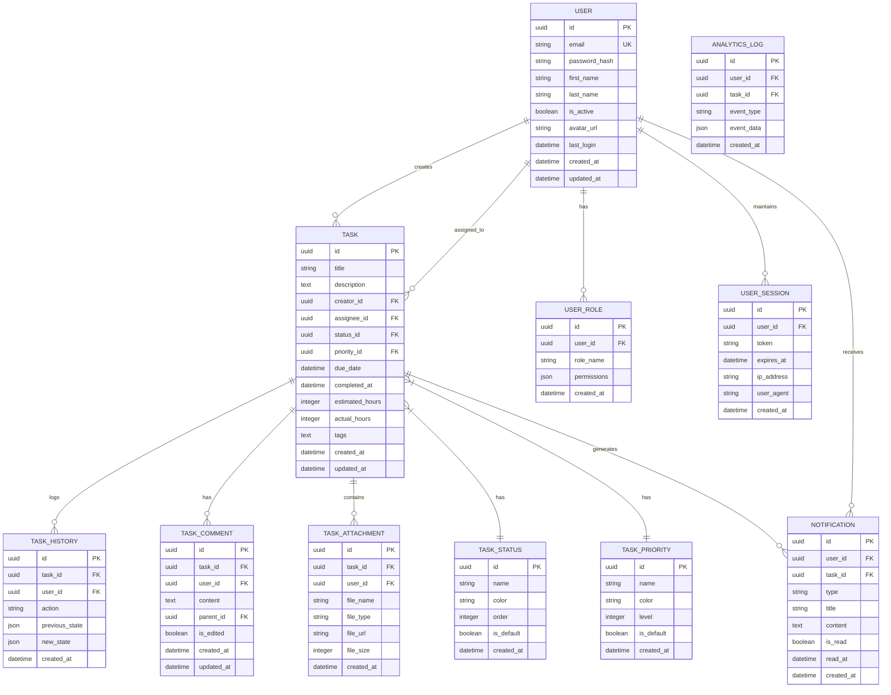

# Task Management System

A comprehensive task management system for development teams built with Node.js.
link [Render](https://task-management-system-k253.onrender.com)

## Project Overview

This system allows development teams to efficiently manage tasks, track progress, and analyze team performance.

### Core Features

- Task Management (creation, editing, deletion)
- User Management (authentication & authorization)
- Analytics (task completion metrics, team activity)
- Integration capabilities (external APIs, databases)
- Automated testing and deployment

### System Architecture

The application follows a modular architecture with the following components:

1. Task Module

   - Task CRUD operations
   - Task assignment
   - Status tracking

2. User Module

   - Authentication
   - Role-based access control
   - User profile management

3. Analytics Module

   - Performance metrics
   - Activity tracking
   - Report generation

4. Integration Module
   - Database connectivity
   - External API integration
   - Notification system

### Tech Stack

- Backend: Node.js with Express.js
- Database: MongoDB/PostgreSQL
- Testing: Jest, Cypress
- CI/CD: GitHub Actions
- Performance Testing: k6

## Getting Started

### Prerequisites

- Node.js (v18 or higher)
- npm (v9 or higher)
- Git

### Installation

1. Clone the repository:

```bash
git clone https://github.com/yourusername/task-management-system.git
cd task-management-system
```

2. Install dependencies:

```bash
npm install
```

3. Create configuration file:

```bash
cp .env.example .env
```

4. Start the development server:

```bash
npm run dev
```

## Project Structure

```
task-management-system/
├── src/
│   ├── controllers/    # Request handlers
│   ├── models/        # Data models
│   ├── routes/        # API routes
│   ├── services/      # Business logic
│   ├── utils/         # Helper functions
│   └── app.js         # Application entry point
├── tests/
│   ├── unit/
│   ├── integration/
│   └── e2e/
├── config/           # Configuration files
└── docs/            # Documentation
```

# Project Architecture Diagram



# Entity-Relationship Diagram (ERD)



## Contributing

1. Create a new branch
2. Make your changes
3. Submit a pull request

## License

MIT
